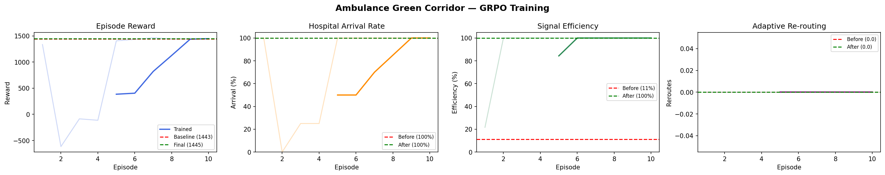

# Ambulance Green Corridor — OpenEnv Hackathon 2026

> **Can an LLM learn to save lives by managing city traffic?**
>
> Every minute of delay in cardiac arrest reduces survival by 10%.
> This environment trains an LLM agent to act as emergency dispatcher AND
> city traffic manager — choosing the right hospital and clearing a dynamic
> green corridor under real-world constraints like potholes, gridlock, accidents,
> and road closures.

**HF Space (live environment):** https://huggingface.co/spaces/Ajitg25/ambulance-green-corridor

---

## The Problem

GPS-based emergency preemption already exists — it clears one signal when an ambulance is 300m away. That's reactive and dumb.

Our agent does something no rule-based system can:

- **Chooses the right hospital** — nearest isn't always fastest. Heavy traffic on the short route means the farther cardiac specialist is actually quicker.
- **Pre-clears signals** — clears the next 3 intersections *before* the ambulance arrives, not after.
- **Reads road quality** — potholed roads slow the ambulance regardless of signal phase. The agent routes around them.
- **Re-routes mid-journey** — when an accident blocks the planned path, the agent detects it and switches hospitals or takes an alternate route.
- **Doesn't waste actions** — toggling a signal that's already green costs reward. The agent learns to only act when necessary.

---

## Environment

The agent plays two roles every episode:

**1. Dispatcher** — given a patient location and condition (cardiac / trauma / stroke), choose a hospital. Specialist hospitals score higher. One hospital may be at capacity.

**2. Traffic Signal Manager** — as the ambulance moves, the agent sees a rolling 3-signal lookahead window. It must clear only signals in the wrong phase. Toggling already-green signals wastes actions and costs reward.

### What the agent sees each step
```
=== EMERGENCY DISPATCH ===
Patient  : (6, 3) | condition: cardiac
Ambulance: (6, 4) | time: 40s / 300s

[ACCIDENT] at (4, 3) — blocking road (severity=0.8)

CURRENT ROUTE → hosp_a
  ETA=251s | segments=8 | damaged=2 | heavy_traffic=1
  (6,4)→(5,4) | residential | quality=moderate | traffic=45% | est=22s
  (5,4)→(4,4) | damaged     | quality=POTHOLED | traffic=62% | est=41s

ALTERNATIVES:
  hosp_c (cardiac) <- specialist match: ETA=130s | damaged=0 | heavy=0

SIGNALS (only change WRONG):
  (5,4): ns_green | dir=north | OK
  (4,4): ew_green | dir=north | WRONG — needs ns_green

ACTION: {"hospital_id": "hosp_c", "signal_controls": [{"row": 4, "col": 4, "phase": "ns_green"}], "preferred_direction": null}
```

### Action space
```json
{
  "hospital_id": "hosp_c",
  "signal_controls": [{"row": 4, "col": 4, "phase": "ns_green"}],
  "preferred_direction": "north"
}
```

### Reward function
| Component | Value |
|---|---|
| Arrival bonus | +1000 |
| Time bonus | up to +500 (faster = more) |
| Specialist hospital match | +300 |
| Red light stop | −20 each |
| Unnecessary signal toggle (step) | −2 each |
| Unnecessary signal toggle (arrival) | −5 each |
| Damaged road segments traversed | −10 each |
| Successful re-route | +50 each |

### Difficulty levels
| Level | Grid | Hospitals | Traffic | Events | Time limit |
|---|---|---|---|---|---|
| easy | 6×6 | 2 | Low | 5%/step | 200s |
| medium | 8×8 | 3 | Moderate | 10%/step | 300s |
| hard | 12×12 | 5 (1 at capacity) | Heavy | 15%/step | 400s |

---

## Training Results

Model: `Qwen/Qwen2.5-0.5B-Instruct` + LoRA (r=16) | Algorithm: GRPO | 10 iterations × 4 episodes


*Left to right: Episode reward, Hospital arrival rate, Signal efficiency, Adaptive re-routing*

| Metric | Baseline (untrained) | Trained | Change |
|---|---|---|---|
| Mean reward | 1442.6 | 1445.3 | +2.7 |
| Arrival rate | 100% | 100% | — |
| **Signal efficiency** | **11%** | **100%** | **+89 pp** |
| Mean travel time | 125s | 127.5s | — |

**The key result: signal efficiency jumped from 11% → 100%.**

The untrained model blindly toggled every signal it saw, wasting actions on signals that were already green. After training, the model learned to read the signal state and only act when a signal is in the wrong phase — exactly the behaviour the reward function was designed to teach.

The training curve shows characteristic GRPO instability in iterations 2–4 (the model briefly lost the plot, arrival dropped to 0–25%) then converged sharply from iteration 5 onwards to stable 100% arrival with perfect signal efficiency.

---

## Why an LLM agent and not a rule?

| Situation | Rule-based (GPS) | LLM Agent |
|---|---|---|
| Short route, gridlocked | Takes it — signal cleared but ambulance crawls at 20% speed | Detects heavy traffic in segment info, takes longer route with better ETA |
| Potholed road | Follows shortest path | Avoids damaged segments to protect patient and maintain speed |
| Accident mid-journey | Gets stuck or re-runs Dijkstra | Sees event in observation, checks alternative ETAs, switches hospital |
| Hospital at capacity | No model for this | Reads `at_capacity` flag, never dispatches there |
| Signal already green | Would toggle it anyway | Learned not to — unnecessary toggles cost reward |

---

## Setup

```bash
# Clone and run locally
git clone -b final https://github.com/ajitg25/openEnv-hackathon.git
cd openEnv-hackathon
uv sync
AMBULANCE_DIFFICULTY=easy uvicorn ambulance_env.server.app:app \
  --app-dir envs --host 0.0.0.0 --port 7860
```

## Training

```bash
# Run GRPO training (requires GPU)
REPO_ROOT=$(pwd) PLOT_DIR=$(pwd)/plots python train.py
```

Training notebook: [`examples/ambulance_grpo_training.ipynb`](examples/ambulance_grpo_training.ipynb)

---

## Links

- **HF Space (live):** https://huggingface.co/spaces/Ajitg25/ambulance-green-corridor
- **GitHub:** https://github.com/ajitg25/openEnv-hackathon/tree/final
- Blog post / video: _coming soon_
